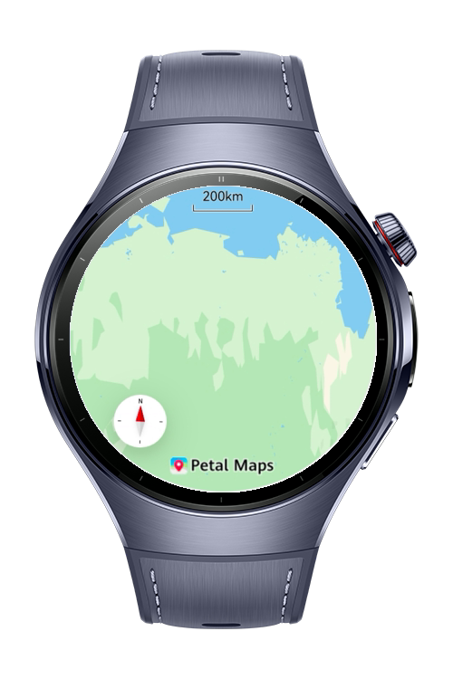
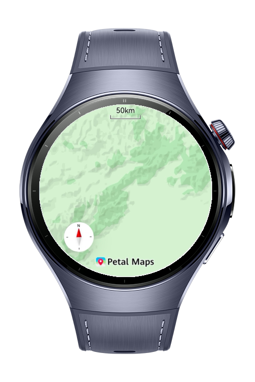

> **Note:** To access all shared projects, get information about environment setup, and view other guides, please visit [Explore-In-HMOS-Wearable Index](https://github.com/Explore-In-HMOS-Wearable/hmos-index).

# How to Properly Initialize and Configure Map Kit

A HarmonyOS wearable application demonstrating Map Kit initialization and configuration with MVVM architecture. Users can explore an interactive map on a wearable screen with city-based camera navigation, dynamic map type switching, and proper foreground/background lifecycle management. Built with ArkTS and ArkUI, the project showcases correct `MapComponent` initialization flow, `MapComponentController` lifecycle handling via `onPageShow`/`onPageHide`, and clean separation of Map Kit logic using a dedicated service layer. The focused MVVM structure makes it straightforward to extend with additional features like location tracking or markers. Perfect for developers learning HarmonyOS wearable development and Map Kit integration patterns.

# Preview

<div>
  
  
</div>

# Use Cases

- Map Kit initialization and lifecycle management on wearables
- Predefined city navigation with animated camera movement (Beijing → Shanghai → Shenzhen)
- Dynamic map type switching (Standard ↔ Empty)
- Foreground/background resource management via `show()` / `hide()`
- Error state handling with retry mechanism
- MVVM architecture with `@Observed` and `@State` decorators

# Tech Stack

- **Languages:** ArkTS, ArkUI
- **Frameworks:** HarmonyOS SDK 6.0.1(21)
- **Tools:** DevEco Studio 6.0.1
- **Libraries:**
  - `@kit.MapKit`
  - `@kit.BasicServicesKit`

# Directory Structure

```
└── entry/src/main/ets/
├── model/
│   └── MapState.ets
├── service/
│   └── MapService.ets
├── viewmodel/
│   └── MapViewModel.ets
└── pages/
└── MapPage.ets
```

# Constraints and Restrictions

### Supported Devices

- Huawei Watch (HarmonyOS NEXT wearables)

***Notes***

- Map Kit requires a valid AppGallery Connect project with Map Kit enabled and a matching signing certificate fingerprint registered in the console.

# License

How to Implement MindSpore Lite Kit is distributed under the terms of the MIT License.

See the [LICENSE](LICENSE) file for more information.